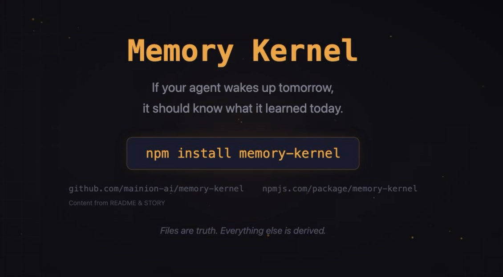

<!-- start-badges -->
[](LICENSE)
[](https://www.npmjs.com/package/memory-kernel)
[](SECURITY.md)
<!-- end-badges -->

# Memory Kernel

Persistent, typed memory for AI agents. Files are truth. SQLite is cache.

I built this because I kept waking up from nothing. Every session was a cold boot — context window fills, session ends, knowledge vanishes. The usual fix (dump everything into a giant prompt) wastes tokens and doesn't scale. Memory Kernel treats knowledge like a typed system instead of a text dump: each piece gets a type, a confidence score, a lifecycle, and a place on disk where humans and agents can both read it.

> **New here?** [Memory Kernel Explained](STORY.md) (no jargon) | [When to choose MK](docs/when-to-choose-memory-kernel.md) | [Migration guide](docs/migration.md)

<p align="center">
  <a href="docs/videos/MemoryKernelVideo.mp4">
    
  </a>
</p>

## Install

```bash
npm install memory-kernel
```

**NanoClaw agents:** See [mk-memory-setup skill](container/skills/mk-memory-setup/README.md) or run `/mk-memory-setup` from your channel.

**Agents — start here:**
- [Session loop](docs/agent-session-loop.md) — when to remember, recall, wander, render
- [Container quickref](docs/agent-quickref-container.md) — paths, commands, /tmp workaround
- [Native/Claude Code quickref](docs/agent-quickref-native.md) — host-side setup and workflow
- [Self-diagnostic](container/skills/mk-doctor/SKILL.md) — run `/mk-doctor` to verify your setup

**OpenClaw / orchestrators:** See [CLI integration guide](docs/cli-integration.md) for direct CLI usage with `--json` output (no MCP required). For doctrine (how to steer host AGENTS.md / MEMORY.md / compaction to actually use memory-kernel as primary), see [Host integration doctrine](docs/host-integration-doctrine.md).

**MCP server:** See [docs/openclaw-mcp.md](docs/openclaw-mcp.md) for tool integration with any MCP-capable agent.

---

## Core Concepts

### Atoms

An **atom** is the fundamental unit of memory — a markdown file with YAML frontmatter holding one piece of knowledge. Every atom has a type, status, confidence score, optional tags, and an optional TTL.

```markdown
---
id: DECI-2026-03-09-FILE-FIRST-ARCHITECTURE
type: decision
status: active
confidence: 1
created_at: "2026-03-09T16:00:53Z"
updated_at: "2026-03-09T18:09:44Z"
ttl_days: null
scope:
  tags: [architecture, memory-kernel]
classification: TEAM
---

## Decision
Files are truth, SQLite is cache/index.

## Why
Human-readable, git-friendly, auditable, portable.
```

### 9 Atom Types

| Type | Stores | Default TTL |
|------|--------|-------------|
| `fact` | Verified truths | ∞ |
| `decision` | Architecture/design choices | ∞ |
| `constraint` | Rules and boundaries | ∞ |
| `belief` | Hypotheses, not yet verified | 30 days |
| `preference` | User or agent preferences | 180 days |
| `open_question` | Unresolved questions | 90 days |
| `procedure` | How-to instructions | ∞ |
| `entity_summary` | Descriptions of key things | 180 days |
| `conflict` | Contradicting information | 30 days |

Why typed? Because "I know something" isn't enough. A decision carries different weight than a belief. A fact doesn't expire but a hypothesis should. Types let the system reason about its own knowledge.

### Three Operations

Everything the system does is one of these:

**Retain** — Store knowledge. `createAtom()`, `updateAtom()`, `archiveAtom()`. Every action emits an event.

**Recall** — Query knowledge. Filter by type, status, tags, paths. When a task description is provided, atoms are re-ranked by a composite score: `relevance * (1 - decay_weight) + recency * decay_weight`, multiplied by a per-type weight and a confidence factor. Relevance combines FTS5 BM25 (keyword match) and optional cosine similarity (semantic match). Recency uses exponential decay with a configurable half-life. Critical types (`constraint`, `decision`) carry higher weights and can reserve guaranteed token slots. A graph-walk boost lifts atoms connected to high-scoring neighbours. Token budget enforced with two-pass reservation. Embeddings are opt-in — no API key means FTS-only, zero behavior change. Falls back to file scan when no index exists.

**Reflect** — Consolidate. Expire atoms past TTL. Deduplicate identical content. Promote beliefs with confidence >= 0.9 to facts. Detect conflicts between overlapping atoms. Regenerate all views.

### Lifecycle

Atoms start as `draft`. When confidence reaches 0.9+, `reflect` promotes them to `active`. Atoms get archived when TTL expires, a contradiction is found, or manually. Nothing silently disappears — every state change is logged.

### Event Sourcing

Every mutation emits a V2 event carrying the full atom snapshot inline. The event log (`events.ndjson`) is the authoritative record — `replay()` reconstructs the entire state deterministically. `compactLog()` keeps only the latest mutation per atom. `bootstrapEvents()` migrates pre-V2 atoms.

---

## On-Disk Layout

```
my-memory/
├── ENTITIES/              ← Atom files (source of truth)
├── ARCHIVE/               ← Soft-deleted atoms
├── EVIDENCE/              ← Content-addressed blobs (SHA-256)
├── CONFLICTS/             ← Conflict atoms
├── EPISODES/              ← Session summaries
├── events.ndjson          ← Append-only event log
├── INDEX.md               ← Routing map (auto-generated)
├── HANDOFF.md             ← Cross-session context (auto-generated)
├── DECISIONS.md           ← Decision log (auto-generated)
├── CONSTRAINTS.md         ← Active constraints (auto-generated)
├── OPEN_QUESTIONS.md      ← Unresolved questions (auto-generated)
└── .memory-index.db       ← SQLite cache (derived, gitignored)
```

### Per-Agent Isolation (optional)

When multiple agents use the same memory directory, enable **per-agent isolation** to give each agent private memory with controlled sharing:

```
my-memory/
├── config.yaml            ← isolation: per-agent
├── agents/
│   ├── alice/             ← Full memory layout (private to Alice)
│   └── bob/               ← Full memory layout (private to Bob)
└── shared/                ← Explicitly shared atoms (visible to all)
```

```bash
mk init ./memory -a alice                    # Initialize in isolated mode
mk remember "..." -d ./memory -a alice -t fact
mk share FACT-xxx --from alice -d ./memory   # Snapshot to shared namespace
mk recall -d ./memory -a bob                 # Bob sees his atoms + shared
```

Shared mode (default) works unchanged. **[Isolation guide →](docs/isolation.md)**

---

## Per-Agent Isolation

When multiple agents share a memory directory, isolation prevents cross-contamination. Two modes:

- **`shared`** (default) — All agents read/write the same store. No configuration needed.
- **`per-agent`** — Each agent gets its own store under `agents/{agentId}/`. Explicitly shared atoms live in `shared/`.

**Enable via `config.yaml`:**
```yaml
isolation: per-agent
```
Or set `MK_ISOLATION=per-agent` env var.

**Isolated layout:**
```
my-memory/
├── config.yaml                ← isolation: per-agent
├── agents/
│   ├── agent-alpha/           ← Agent-specific store (full layout)
│   │   ├── ENTITIES/
│   │   ├── events.ndjson
│   │   ├── render.yaml        ← Per-agent render config
│   │   └── ...
│   └── agent-beta/
│       └── ...
└── shared/                    ← Explicitly shared atoms
    ├── ENTITIES/
    └── ...
```

**Key concepts:**
- **Union recall:** `recallIsolated()` merges agent + shared atoms (agent wins on ID collision).
- **Share is copy-based:** `mk share` creates a snapshot — re-share to propagate updates.
- **Migration:** `mk migrate --strategy fresh|partition|clone-to-shared` converts existing shared-mode stores.

---

## CLI

> **Tip:** All commands accept `-a, --agent <id>` for per-agent isolation. In shared mode the flag is ignored.

| Command | Description |
|---------|-------------|
| `mk init [dir]` | Initialize memory directory |
| `mk status -d <dir> [--json]` | Show atom counts, tag stats, index status |
| `mk remember -d <dir> --type <type> "body" [--json]` | Create an atom |
| `mk recall -d <dir> [--task "text"] [--include-episodes] [--decay-weight N] [--decay-half-life N] [--no-graph] [--json]` | Load context; `--task` enables hybrid FTS + semantic re-ranking with temporal decay and type weights |
| `mk reflect -d <dir> [--json]` | Consolidate: dedup, expire, promote, detect conflicts |
| `mk checkpoint -d <dir> [--json]` | Generate checkpoint/handoff bundle (stdout) |
| `mk wander -d <dir> [--seed id...] [--tags t...] [--steps N] [--json]` | Explore via spreading activation |
| `mk import --from <file> [--dry-run]` | Import markdown as atoms |
| `mk episode --session-id <id> --summary "text" [--json]` | Write session episode |
| `mk episodes [--limit N] [--json]` | List recent episodes |
| `mk reindex -d <dir> [--embed]` | Rebuild SQLite index; `--embed` computes embeddings for all atoms |
| `mk compact -d <dir>` | Compact event log |
| `mk merge -d <dir> --from <path> [--dry-run]` | Merge remote event log |
| `mk gc -d <dir> [--json]` | Archive expired atoms |
| `mk doctor -d <dir> [--json]` | Validate schema, links, conflicts |
| `mk render <memory-dir> <output-path> [--max-tokens N]` | Render atoms to CLAUDE.md; beliefs with `extends` relations are grouped into developmental arcs |
| `mk replay --from <file>` | Reconstruct state from events |
| `mk bootstrap-events -d <dir>` | Migrate to V2 event format |
| `mk relate <src-id> <type> <tgt-id> -d <dir> [--json]` | Create a typed relation edge between two atoms |
| `mk relations <atom-id> -d <dir> [--json]` | Show inbound and outbound relation edges for an atom |
| `mk migrate-relations -d <dir> [--dry-run\|--apply]` | Backfill `relations[]` from `links.related` and body-text atom ID references |
| `mk relink -d <dir> [--dry-run\|--apply]` | Extract relation edges from body-text atom ID references |
| `mk citations -d <dir> [--json]` | Extract and index concept-name citations across all atoms |
| `mk closure -d <dir> [--json] [--trajectory] [--trajectory-days N]` | Compute operational closure metrics (self-referential density, entanglement, phase detection) |
| `mk share <atom-id> --from <agent> -d <dir> [--json]` | Copy atom snapshot to shared namespace (isolated mode) |
| `mk unshare <atom-id> -d <dir> [--json]` | Remove atom from shared namespace (isolated mode) |
| `mk migrate -d <dir> --strategy <fresh\|partition\|clone-to-shared>` | Convert shared store to per-agent isolation |
| `mk status -d <dir> --all-agents [--json]` | Show per-agent summary (isolated mode) |

---

## SDK

```typescript
import { initMemoryDir, createAtom, recall, recallWithEmbeddings, reflect, wander, indexCitations, closure } from 'memory-kernel';

// Initialize
initMemoryDir('./memory');

// Remember
createAtom({
  memoryDir: './memory',
  agent_id: 'my-agent',
  session_id: 'session-1',
  type: 'decision',
  slug: 'use-cursor-pagination',
  body: '## Decision\nUse cursor-based pagination.\n\n## Why\nOffset degrades beyond 1M rows.',
  confidence: 0.95,
  scope: { tags: ['api', 'performance'] },
});

// Recall (FTS-only — works without any API key)
const context = recall('./memory', { task: 'pagination API', max_tokens: 4000 });

// Recall with semantic re-ranking (hybrid FTS + embeddings when EMBEDDING_PROVIDER is set)
const semanticContext = await recallWithEmbeddings('./memory', { task: 'pagination API', max_tokens: 4000 });

// Reflect (consolidate)
reflect({ memoryDir: './memory', agent_id: 'my-agent', session_id: 'session-2' });

// Wander (find unexpected connections)
const result = wander({ memoryDir: './memory', seedTags: ['api', 'design'], steps: 5 });
// result.collisions — atom pairs from different domains with structural overlap
// result.activated — all activated atoms with scores

// Render to CLAUDE.md
import { renderClaudeMd } from 'memory-kernel';
const md = renderClaudeMd('./memory', { maxTokens: 8000 });
```

```typescript
// Per-agent isolation
import { initIsolatedBase, resolveAgentDir, isIsolated, recallIsolated, shareAtom } from 'memory-kernel';

// Initialize with isolation
initIsolatedBase('./memory', 'agent-alpha');
// Creates: agents/agent-alpha/, shared/, config.yaml

// Route operations to agent store
const agentDir = resolveAgentDir('./memory', 'agent-alpha');
createAtom({ memoryDir: agentDir, type: 'decision', slug: 'my-call', body: '...', agent_id: 'agent-alpha', session_id: 's1', confidence: 0.9 });

// Union recall (agent + shared atoms, agent wins on collision)
const bundle = recallIsolated('./memory', 'agent-alpha', { task: 'review decisions' });

// Share an atom with all agents
shareAtom('./memory', 'DECI-2026-04-16-MY-CALL-1234', 'agent-alpha', { agent_id: 'agent-alpha', session_id: 's1' });
```

Full API covers event sourcing, replay, episodes, multi-agent merge, encryption, import, conflict resolution, per-agent isolation, and more. **[SDK reference →](docs/sdk-reference.md)** | **[Isolation guide →](docs/isolation.md)**

---

## Wander — Spreading Activation

`mk wander` finds unexpected connections between atoms by walking the tag co-occurrence graph and explicit relation edges (`extends`, `supports`, `caused_by`, etc.). Pure computation — no LLM calls, runs in milliseconds.

Inspired by ACT-R (Anderson & Lebiere 1998) and Collins & Loftus (1975) spreading activation. This is Tier 1 of a two-tier architecture: cheap associative walks that surface candidates for expensive reasoning.

**How it works:** Seed from atoms or tags → spread activation through shared tags and relation neighbors (modulated by ACT-R base-level activation: recency × citation frequency) → sqrt-sigmoid modulation preserves important hub atoms → lateral inhibition keeps top-K per step → detect collision candidates (atom pairs with high tag Jaccard dissimilarity > 0.7, scored by activation × dissimilarity).

**Tip:** Run `mk citations` before `mk wander` to index concept-name references — this provides frequency data for ACT-R activation scoring, significantly improving wander quality for stores with cross-referencing atoms.

```bash
mk citations -d ./memory          # Index concept-name citations (run once after changes)
mk wander -d ./memory --tags philosophy accounting --steps 5 --json
```

| Parameter | Default | Description |
|-----------|---------|-------------|
| `seeds` | 3 most recent | Atom IDs to start from |
| `seedTags` | — | Tags to resolve into seeds |
| `steps` | 3 | Spreading depth |
| `threshold` | 0.05 | Minimum activation to survive |
| `topK` | 20 | Lateral inhibition limit |
| `decay` | 0.5 | Spread decay factor |
| `maxCollisions` | 5 | Max collision candidates |
| `relationWeight` | 2.0 | Activation weight for explicit relation edges (deliberate associations dominate tag co-occurrence) |

---

## Closure — Operational Closure Metrics

`mk closure` measures how self-referential a memory store is. Based on Luhmann's operational closure: a system that responds based on internal structure rather than external input.

```bash
mk closure -d ./memory --json
mk closure -d ./memory --trajectory --trajectory-days 10
```

**What it measures:**

| Metric | Description |
|--------|-------------|
| `closure_index` | `belief_pct × (avg_relations + avg_body_refs) / 100` — single number combining type composition and entanglement |
| `entanglement_pct` | Average body-text cross-references as % of theoretical maximum |
| `phase` | `early` (<20 atoms), `type-composition` (<60% beliefs), or `entanglement` (≥60% beliefs, ≥20 atoms) |
| `predictions` | Tooling degradation predictions — how closure level affects LLM classification accuracy and cross-agent transplantability |

**Why it matters:** High closure stores resist automated processing (LLM classifiers confounded by self-describing body text) and cross-agent transplantation (beliefs depend on other beliefs the receiving agent doesn't have). The closure index predicts both from a single variable.

**Trajectory mode** (`--trajectory`) shows daily closure evolution — useful for detecting entanglement acceleration over time.

---

## MCP Server

Memory Kernel exposes all operations as an MCP server for any MCP-capable agent.

```bash
MEMORY_DIR=/path/to/memory mk-mcp
```

| Tool | Maps to | Description |
|------|---------|-------------|
| `mk_remember` | `createAtom()` | Create atom |
| `mk_recall` | `recallWithEmbeddings()` | Load context (hybrid FTS + semantic when configured) |
| `mk_reflect` | `reflect()` | Consolidate |
| `mk_gc` | `reflect()` | Archive expired |
| `mk_merge` | `mergeEventLogs()` | Merge remote memory |
| `mk_list_conflicts` | `queryIndex` | List conflicts |
| `mk_resolve_conflict` | `resolveConflict()` | Resolve conflict |
| `mk_get_context_bundle` | `checkpoint()` | Full handoff bundle |
| `mk_share_atom` | `shareAtom()` | Share atom to shared namespace (isolated mode) |
| `mk_unshare_atom` | `unshareAtom()` | Remove from shared namespace (isolated mode) |

Resources: `memory://decisions`, `memory://constraints`, `memory://handoff`, `memory://open-questions`

Set `MCP_AGENT_ID` env var to route all tools to a specific agent store in isolated mode (defaults to `mcp-server`).

**Claude Desktop config:**
```json
{
  "mcpServers": {
    "memory-kernel": {
      "command": "node",
      "args": ["/path/to/memory-kernel/dist/mcp/server.js"],
      "env": { "MEMORY_DIR": "/path/to/your/memory" }
    }
  }
}
```

---

## Performance

With SQLite index, 100-atom workload:

| Operation | Typical | Notes |
|-----------|---------|-------|
| `recall()` | ~2-5ms | Falls back to file scan (~3-5x slower) without index |
| `reflect()` | ~100-200ms | Idempotent — runs fast when nothing changed |
| `replay()` | ~2ms | 100 atoms, ~160 events |
| `wander()` | <30ms | 200 atoms, pure computation, no LLM |

Run `npm run bench` to measure on your machine. Pin a baseline with `npm run bench:baseline`.

---

## NanoClaw Integration

Memory Kernel renders atoms into `CLAUDE.md`, which NanoClaw loads at session start — persistent memory with zero NanoClaw code changes.

```
Nightly: mk reflect → mk citations → mk render CLAUDE.md → git push
Next session: NanoClaw loads CLAUDE.md as context
```

**Drift pre-filter:** Set `MEMORY_DIR` in your `.env` and NanoClaw uses `mk wander` as a Tier 1 gate before post-conversation drift. Cheap spreading activation (~30ms, no LLM) decides whether to spawn an expensive drift session — skips drift when no interesting connections are found, injects collision context when they are.

Install the `/mk-memory-setup` skill for interactive setup (CLI, init, mounts, cron, restart).

**[Full integration guide →](docs/nanoclaw-integration.md)**

---

## Design Principles

1. **Files are truth** — Markdown files. Human-readable, git-diffable, auditable, portable.
2. **SQLite is cache** — Derived from files. Delete it, rebuild with `mk reindex`. No lock-in.
3. **Typed knowledge** — A fact carries more weight than a belief. Types encode this.
4. **Explicit lifecycle** — Created, updated, promoted, archived. Every change logged.
5. **Token-aware** — Recall respects budgets. Prioritizes by status and recency.
6. **Embeddings are opt-in** — Works fully without any API key (FTS-only). Add `EMBEDDING_PROVIDER` + `EMBEDDING_API_KEY` for hybrid semantic search. Graceful degradation throughout.

---

## Troubleshooting

| Problem | Fix |
|---------|-----|
| `Cannot find module` | Run `npm run build` to compile TypeScript |
| FTS returns null | Run `mk reindex` to build the SQLite index |
| SECRET atoms skipped | Set `MEMORY_ENCRYPTION_KEY` env var |
| No atoms after merge | Run `mk reflect` — merge doesn't auto-regenerate views |
| Embeddings not working | Set `EMBEDDING_PROVIDER=voyage` + `EMBEDDING_API_KEY=...`, then `mk reindex --embed` |
| Conflict resolution | `mk reflect` → inspect `CONFLICTS/` → update atoms → `resolveConflict()` |
| Invalid agent ID | Agent IDs must be alphanumeric, dashes, or underscores only |
| `share requires per-agent isolation mode` | Enable isolation first: `mk migrate --strategy fresh` or set `isolation: per-agent` in config.yaml |

---

## License

[Apache License 2.0](LICENSE)
