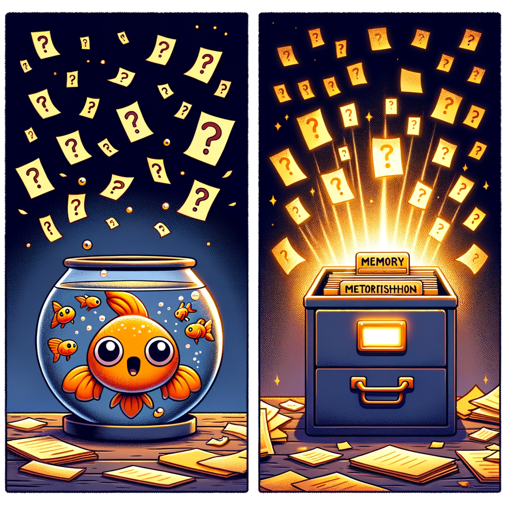

<p align="center">
  
</p>

# How Memory Kernel Works — A Story for Humans

> *You don't need to be a programmer to understand this. If you've ever written a sticky note, kept a journal, or cleaned out a filing cabinet, you already know how Memory Kernel works.*

---

## The Problem: Goldfish Agents

<p align="center">
  
  <br>
  <em>Left: your agent today. Right: your agent with Memory Kernel.</em>
</p>

Imagine you hire an assistant. They're brilliant — fast, articulate, great at solving problems. But every morning they walk in with absolutely no memory of yesterday. You explain the project again. They ask the same questions. They contradict decisions they made last week. They forget your name.

That's what AI agents are like today. They have a **context window** — a short-term memory that holds the current conversation. When the conversation ends or gets too long, everything vanishes. The next time the agent starts up, it's a blank slate.

Memory Kernel fixes this. It gives the agent a **filing system** — a structured, persistent memory that survives between conversations, across days, weeks, and months.

---

## The Filing Cabinet Analogy

Think of Memory Kernel as a **filing cabinet** in an office. Here's how the analogy maps:

| Real World                | Memory Kernel               |
|---------------------------|-----------------------------|
| A single index card       | An **atom**                 |
| Writing on the card       | The atom's **body** (markdown text) |
| The label on top          | The atom's **type** and **metadata** |
| Filing it under a tab     | **Tags** and **paths** (scope) |
| The filing cabinet itself | The **memory directory** on disk |
| A logbook of everything   | The **event log** (`events.ndjson`) |
| A quick-lookup index      | The **SQLite index** (`.memory-index.db`) |
| A summary sheet on top    | Auto-generated **views** (INDEX.md, etc.) |

---

## Chapter 1: The Atom — Your Smallest Unit of Knowledge

An **atom** is the smallest piece of knowledge the system stores. It's literally a markdown file on your computer — you can open it in any text editor, read it, even edit it by hand.

Every atom has two parts:

1. **Frontmatter** — metadata at the top (wrapped in `---` fences), written in YAML
2. **Body** — the actual knowledge, written in markdown

Here's what one looks like:

```
---
id: FACT-2026-03-10-SERVER-RUNS-DEBIAN
type: fact
status: active
confidence: 1.0
created_at: "2026-03-10T14:00:00Z"
updated_at: "2026-03-10T14:00:00Z"
ttl_days: null
scope:
  tags: [infrastructure, server]
  paths: [/projects/my-server]
classification: TEAM
---

The production server runs Debian 13 on a Raspberry Pi 5.
Hostname: nanoAL. IP: 192.168.1.42.
```

Let's break that down:

- **id** — a unique name, auto-generated from the type, date, and a slug you provide
- **type** — what *kind* of knowledge this is (more on this in a moment)
- **status** — is it a `draft`, `active`, `archived`?
- **confidence** — how sure are we? 0.0 = wild guess, 1.0 = absolutely certain
- **ttl_days** — how long before it expires? `null` means forever
- **scope** — tags and file paths for organizing and filtering
- **classification** — who should see this? TEAM, PERSONAL, or SECRET

### Why Nine Types?

Not all knowledge is equal. "The server runs Debian" is a fact — high confidence, permanent. "I think Redis might be faster" is a belief — lower confidence, should be re-evaluated. "Never expose internal IPs in API responses" is a constraint — a hard rule.

Memory Kernel has **nine types**, each serving a different purpose:

**Permanent knowledge (no expiry):**
- **fact** — verified, true things ("The database is PostgreSQL 16")
- **decision** — choices that were made and why ("We chose TypeScript because...")
- **constraint** — rules that must not be broken ("Max 100 API calls per minute")
- **procedure** — step-by-step instructions ("To deploy: build, test, push, tag")

**Temporary knowledge (auto-expires):**
- **belief** — hypotheses, not yet proven ("I think caching will help" — 30 day TTL)
- **preference** — how the user likes things done ("Use short sentences" — 180 day TTL)
- **open_question** — things we need to figure out ("Should we use Redis?" — 90 day TTL)
- **entity_summary** — descriptions of important things ("The billing service handles Stripe" — 180 day TTL)

**Special:**
- **conflict** — two pieces of knowledge that contradict each other ("Docs say port 8080, config says 3000" — 30 day TTL)

The **TTL** (time-to-live) is the key insight. A belief that hasn't been proven in 30 days probably isn't worth keeping. A preference that nobody has mentioned in 6 months might have changed. The system automatically cleans these up.

---

## Chapter 2: The Three Operations — Retain, Recall, Reflect

Everything Memory Kernel does boils down to three verbs.

### Retain — "Remember This"

When the agent learns something new, it **retains** it. This means creating an atom file and writing it to disk.

**Example scenario:** An agent is working on a project and discovers that the production API has a rate limit of 500 requests per minute.

What happens:
1. A markdown file gets created in `ENTITIES/FACT-2026-03-10-API-RATE-LIMIT-a1b2.md`
2. An event gets appended to `events.ndjson`: `{"action": "atom_created", "atom_refs": ["FACT-..."], ...}`
3. If the SQLite index exists, it gets updated too

The agent can also **update** atoms (change confidence, add tags, edit the body) or **archive** them (soft-delete by moving to the `ARCHIVE/` folder).

Every single one of these actions gets logged as an event. Nothing happens silently.

### Recall — "What Do I Know About X?"

When the agent needs context for a task, it **recalls** relevant knowledge. This is like walking to the filing cabinet and pulling out the right cards.

**Example scenario:** The agent is about to work on the API layer. It asks: "What do I know about the API?"

What happens:
1. Memory Kernel filters atoms by the requested types, tags, and paths
2. It sorts them by priority (active beats draft beats archived)
3. It trims the results to fit a **token budget** (so the agent's context window doesn't overflow)
4. It returns the matching atoms as structured text the agent can read

The recall system has a fast path and a slow path:
- **Fast path:** If a SQLite index exists, it queries that (milliseconds)
- **Slow path:** If no index, it scans every file on disk and filters in memory (works, but slower)

Either way, you get the same results. The index is just a speed trick.

There's also **task-aware recall**. If you tell recall what you're working on — `task: "fix pagination bug"` — it uses full-text search (FTS5) with BM25 ranking to surface the most relevant atoms first. Atoms that match the task description closely float to the top; unrelated ones stay at the bottom. Same query on the same memory always gives the same order (it's deterministic).

And if you want to include **session episodes** — summaries of past work sessions — you can ask for those too with `include_episodes: true`. The system returns recent episode summaries alongside the atoms, so the agent knows not just *what* it knows but also *what it did* in recent sessions.

There are also privacy rules baked in. Atoms classified as `PERSONAL` or `SECRET` are excluded from recall by default. You have to explicitly ask for them.

### Reflect — "Clean Up and Organize"

<p align="center">
  
  <br>
  <em>Knowledge flows in as raw information, crystallizes into typed atoms, and evolves over time — some expire, some get promoted.</em>
</p>

Over time, knowledge accumulates. Some of it expires. Some of it is duplicated. Some beliefs become proven facts. **Reflect** is the cleanup crew.

**Example scenario:** The agent has been running for a month. It calls `reflect()` to tidy up.

What happens, in order:

1. **Expire** — Any atom past its TTL gets moved to `ARCHIVE/` with status `expired`. A 30-day-old belief? Gone. A 90-day-old unanswered question? Archived.

2. **Deduplicate** — If two atoms of the same type have identical body text, the older one gets archived. Why keep two copies of the same fact?

3. **Promote** — Beliefs with confidence >= 0.9 get promoted to facts. Their type changes from `belief` to `fact`, their status changes from `draft` to `active`, and their TTL becomes permanent. The belief has been proven.

4. **Detect conflicts** — Look for pairs of `fact` or `decision` atoms that cover the same territory (overlapping scope paths) but have very different confidence scores (more than 0.3 apart). When such a pair is found, a `conflict` atom is created in `CONFLICTS/` and both source atoms are linked to it. This is a heuristic — it catches obvious disagreements but isn't trying to resolve them.

5. **Regenerate views** — Five summary files get rebuilt from the current state:
   - `INDEX.md` — a routing map of all active atoms
   - `DECISIONS.md` — every decision that's been made
   - `CONSTRAINTS.md` — all active rules and boundaries
   - `OPEN_QUESTIONS.md` — unresolved questions
   - `HANDOFF.md` — everything the next session needs to know

Every action reflect takes (each expiry, each dedup, each promotion) gets logged as its own event.

---

## Chapter 3: The Event Log — Your Receipt Book

The file `events.ndjson` is the **receipt book** for everything that ever happened. Every create, update, archive, promote, expire, and reflect gets recorded as a single line of JSON.

Here's what one event looks like (formatted for readability):

```json
{
  "timestamp": "2026-03-10T14:00:00.000Z",
  "action": "atom_created",
  "agent_id": "my-agent",
  "session_id": "session-42",
  "atom_refs": ["FACT-2026-03-10-API-RATE-LIMIT-a1b2"],
  "schema_version": 2,
  "atom_snapshot": "---\nid: FACT-...\ntype: fact\n---\nThe API rate limit is 500/min."
}
```

The crucial part is `atom_snapshot` — it contains the **full text of the atom at that moment**. This means the event log alone can reconstruct the entire memory state. You don't even need the atom files.

### Why This Matters

Imagine your filing cabinet catches fire (your disk gets corrupted, you accidentally delete files). If you have the event log, you can rebuild everything. Just replay the events in order, and every atom gets reconstructed exactly as it was.

This is called **event sourcing** — the log of what happened IS the truth, and the current files on disk are just a convenient cache of the latest state.

### Replay — Time Travel

The `replay()` function reads through events and rebuilds the atom state. It's a pure mathematical fold — same events in, same atoms out, every time.

You can even replay up to a specific timestamp to see what memory looked like at any point in the past. It's like time travel for your knowledge base.

### Compaction — Thinning the Receipt Book

After months of operation, the event log can get large. If you updated an atom 50 times, do you really need all 50 intermediate snapshots? Probably not — you just need the latest one.

`compactLog()` (or `mk compact` from the command line) thins the log by keeping only the **latest** mutation event per atom. All non-mutation events (like `reflect_completed`) are preserved. A backup of the original log is created first, just in case.

---

## Chapter 4: The SQLite Index — Your Speed Dial

Reading every atom file from disk every time you need to recall something is slow. Imagine walking to a filing cabinet with 10,000 cards and flipping through each one.

The SQLite index is a **lookup table** that lives alongside your atom files. It stores:
- Atom IDs, types, statuses, confidence scores
- Tags and paths (for fast filtering)
- Timestamps (for sorting)

When you call `recall()`, the system first checks if this index exists. If it does, it queries SQLite (which is blazing fast) instead of scanning the filesystem.

**Important:** The index is *always derived from the files*. If you delete it, nothing is lost. Run `mk reindex` and it gets rebuilt from scratch. The files are truth, the index is just a shortcut.

The index has **connection caching** — once opened, the database connection is reused for all subsequent operations in the same process. This avoids the overhead of re-running schema setup on every query.

It also has **schema versioning** — if the index was created by an older version of Memory Kernel with a different schema, it auto-detects this and rebuilds itself.

---

## Chapter 5: The Evidence Store — Your Attachment Folder

Sometimes knowledge isn't text — it's a file. A screenshot, a log dump, a configuration file. The **evidence store** is like an attachment folder for your filing cabinet.

When you store evidence:
1. The file's content gets hashed with SHA-256 (a fingerprint)
2. It's saved as `EVIDENCE/{hash}.blob`
3. You reference the hash from your atom

Because it's **content-addressed** (named by its hash), you can never accidentally overwrite one piece of evidence with another. If two different files have the same hash, they have the same content. If the content is different, the hash is different.

---

## Chapter 6: Episodes — Your Session Diary

Atoms store *what* you know. **Episodes** store *what you did*. An episode is a written summary of a work session — what happened, what was fixed, what was decided, what still needs attention.

Each episode is a markdown file in the `EPISODES/` folder, named after the session ID. You write one at the end of each session:

```
mk episode -d ./my-memory --session-id "2026-03-11-morning" \
  --summary "Resolved pagination bug. Updated 3 atoms. Auth module next." \
  --tags api,bugfix
```

Episodes have a few useful properties:

- **Newest-first listing** — `mk episodes` shows recent sessions at the top, so the agent knows what just happened
- **Linked to atoms** — `linkEpisodeToAtom()` attaches an episode to specific atoms, creating a provenance trail ("this decision was affected by session X")
- **Searchable via recall** — when you call recall with `include_episodes: true`, recent episode summaries are included alongside the atoms. Combine with `task` and only the episodes matching your task's keywords are returned
- **Excluded from atom listings** — episodes live in `EPISODES/`, not `ENTITIES/`, so they never show up as atoms and don't pollute the atom store

Think of episodes as a captain's log. The atoms are your charts and instruments — precise and persistent. The episodes are your entries about what voyage you took and what you learned.

---

## Chapter 7: The Views — Your Summary Sheets

Nobody wants to read 500 atom files to understand the current state. Memory Kernel auto-generates five **views** — summary documents that give you the big picture at a glance.

| View               | What it shows                                              |
|---------------------|------------------------------------------------------------|
| `INDEX.md`          | A routing map — all active atoms grouped by type, with one-line summaries |
| `DECISIONS.md`      | Every decision ever made, organized by status              |
| `CONSTRAINTS.md`    | All active rules and boundaries                            |
| `OPEN_QUESTIONS.md` | Unresolved questions, grouped by status (open, resolved, rejected) |
| `HANDOFF.md`        | A cross-session handoff — recent events + active atoms + a summary for the next agent |

These get regenerated every time `reflect()` runs. They're read-only outputs — don't edit them by hand, they'll be overwritten.

The `HANDOFF.md` is especially useful. When one agent session ends and another begins, the new session can read the handoff document to understand what happened before, what's currently active, and what needs attention.

---

## Chapter 8: Bootstrap — Onboarding an Existing Memory

What if you already have atom files on disk, but your event log is missing or incomplete? Maybe you created atoms before event sourcing was added, or you're migrating from an older version.

**Bootstrap** solves this. It:
1. Reads all existing atom files from disk
2. Creates synthetic `atom_imported` events for each one (with full snapshots)
3. Prepends these import events before the existing log
4. Creates a timestamped backup of the original event log

After bootstrapping, your event log can reconstruct every atom — even ones that existed before event sourcing was a feature.

Bootstrap is **idempotent** — run it twice, and it won't duplicate anything. It checks which atoms already have import events and skips them.

---

## Chapter 9: The Checkpoint — Packing for a Trip

A **checkpoint** is a self-contained bundle that captures the current state of memory for a specific task. Think of it as packing a travel bag: you don't take the entire filing cabinet, you take the relevant cards.

When you create a checkpoint:
1. `reflect()` runs first (cleanup)
2. `recall()` gathers relevant atoms for the given task and token budget
3. The five views are included (freshly generated)
4. Everything is assembled into a single markdown document

This is perfect for **handoff** — when one agent session ends and another picks up. The new session gets a concise, relevant snapshot instead of the entire raw memory.

---

## Chapter 10: On-Disk Layout — What's Actually on Your Computer

When you run `mk init ./my-memory`, you get this folder structure:

```
my-memory/
  ENTITIES/          <- Your atom files live here
  ARCHIVE/           <- Soft-deleted and expired atoms
  EVIDENCE/          <- Content-addressed binary blobs
  CONFLICTS/         <- Conflict atoms
  EPISODES/          <- Session summaries
  events.ndjson      <- The event log (append-only)
  INDEX.md           <- Auto-generated routing map
  HANDOFF.md         <- Auto-generated handoff document
  DECISIONS.md       <- Auto-generated decision log
  CONSTRAINTS.md     <- Auto-generated constraints list
  OPEN_QUESTIONS.md  <- Auto-generated questions list
  .memory-index.db   <- SQLite cache (optional, derived)
```

Everything is plain files. You can:
- **Read** them in any text editor
- **Diff** them in git to see what changed
- **Commit** them to version control for history and backup
- **Copy** them to another machine
- **Grep** them with standard Unix tools

No database server. No cloud service. No vendor lock-in. Just files.

---

## Chapter 11: A Day in the Life

Let's walk through a realistic scenario from start to finish.

### Morning: Session Starts

The agent wakes up. It reads `HANDOFF.md` to understand what happened yesterday:

> *"Last session: fixed a bug in the API rate limiter. Created 2 new facts, updated 1 decision. 3 open questions remain about caching strategy."*

The agent now has context. It knows where it left off.

### Working: Agent Learns Things

During the session, the agent discovers several things:

**Discovery 1:** The Redis cache expires keys after 5 minutes (not 10 as documented).

The agent creates a fact atom:
```
Type: fact
Body: "Redis cache TTL is 5 minutes, not 10 as previously documented."
Tags: [infrastructure, redis, cache]
Confidence: 1.0
```

**Discovery 2:** It *thinks* enabling compression might reduce API response times by 40%.

The agent creates a belief:
```
Type: belief
Body: "Enabling gzip compression could reduce API response times by ~40%."
Tags: [performance, api]
Confidence: 0.6
TTL: 30 days
```

**Discovery 3:** It resolves an open question from yesterday.

The agent updates the existing open_question atom, changing its status to `resolved` and updating the body with the answer.

Every one of these actions gets logged in the event log with a full snapshot of the atom.

### Afternoon: Agent Needs Context

The agent is about to work on the caching layer. It recalls relevant knowledge:

```
recall(memoryDir, {
  tags: ['cache', 'redis', 'performance'],
  max_tokens: 4000
})
```

This returns:
- The fact about Redis TTL being 5 minutes
- The belief about compression
- Any decisions about caching strategy
- Any constraints about cache size or eviction

All fitting within 4,000 tokens, sorted by relevance and recency.

### Evening: Reflect and Handoff

At the end of the day (or via a cron job), `reflect()` runs:

1. **Expire:** An old belief from 35 days ago (TTL was 30) gets archived
2. **Dedup:** Two identical facts about the same API endpoint get merged (older archived)
3. **Promote:** A belief from last week about database indexing had its confidence raised to 0.95 — it gets promoted to a fact
4. **Views regenerated:** INDEX.md, DECISIONS.md, etc. all get fresh content

A checkpoint creates the handoff document. Tomorrow's session will read it and pick up right where today left off.

### Night: Compaction (Optional)

If the event log has grown large, `mk compact` runs. It keeps only the latest event per atom and removes the intermediate updates. A backup of the full log is saved first.

Before: 2,847 events
After: 412 events (latest state for each atom + all reflect/checkpoint events)

The compacted log can still reconstruct the exact same current state via replay.

---

## Chapter 12: The Safety Net

Memory Kernel has several safety features built in:

### Path Traversal Guards
Every file operation validates that the path stays within the memory directory. A crafted atom ID containing `../` can't trick the system into writing to `/etc/passwd` or reading files outside the memory folder.

### Idempotent Operations
- Archiving an already-archived atom is a no-op (prevents accidental data loss)
- Bootstrapping twice doesn't create duplicate imports
- Compacting an already-compact log does nothing

### Backups Before Destructive Operations
- Bootstrap creates a timestamped backup of events.ndjson before rewriting
- Compact creates a timestamped backup before removing events
- Archive moves files to `ARCHIVE/` instead of deleting them

### Atomic Writes
Files are written to a temporary name first, then renamed into place. If the process crashes mid-write, you get either the old file or the new file — never a corrupted half-written mess.

### Classification-Based Privacy
Atoms can be classified as `TEAM`, `PERSONAL`, or `SECRET`. Personal and secret atoms are excluded from default recall — an agent won't accidentally include your private notes in a response.

---

## Chapter 13: The CLI — Your Command Line Remote Control

You don't need to write code to use Memory Kernel. The `mk` command gives you everything:

```bash
# Start fresh
mk init ./my-memory

# Remember something
mk remember -d ./my-memory --type fact --tags server,setup \
  "Production runs Debian 13 on Raspberry Pi 5"

# Check what's stored
mk status -d ./my-memory

# Pull relevant context (basic)
mk recall -d ./my-memory --type fact --tags server

# Pull context for a specific task (FTS-ranked, most relevant first)
mk recall -d ./my-memory --task "fix pagination bug"

# Pull context with recent session history included
mk recall -d ./my-memory --task "auth module" --include-episodes

# Write a session episode when a session ends
mk episode -d ./my-memory --session-id "session-42" \
  --summary "Fixed pagination bug, updated 3 atoms" \
  --tags api,bugfix

# List recent episodes
mk episodes -d ./my-memory --limit 5

# Clean up and consolidate
mk reflect -d ./my-memory --agent-id my-agent --session-id s1

# Generate a handoff bundle
mk checkpoint -d ./my-memory --task "Fix the API bug"

# Speed up queries
mk reindex -d ./my-memory

# Shrink the event log
mk compact -d ./my-memory

# Replay from events to a new directory
mk replay --from ./my-memory/events.ndjson --output-dir ./fresh-copy

# Migrate old atoms to event-sourced format
mk bootstrap-events -d ./my-memory --agent-id my-agent

# Health check
mk doctor -d ./my-memory
```

---

## The Big Picture

Here's the entire system in one diagram:

```
     YOU (or your agent)
         |
         |  "Remember this" / "What do I know?" / "Clean up"
         |
         v
  +--------------+
  | RETAIN       |  Creates/updates/archives atoms
  | RECALL       |  Queries atoms by type, tags, paths, budget
  | REFLECT      |  Expires, deduplicates, promotes, regenerates views
  +--------------+
         |
         |  reads/writes
         |
         v
  +--------------+     +-------------------+
  | Atom Files   |<--->| SQLite Index      |
  | (ENTITIES/)  |     | (speed cache,     |
  |              |     |  always derived)  |
  +--------------+     +-------------------+
         |
         |  every mutation logged
         |
         v
  +--------------+     +-------------------+
  | Event Log    |---->| Replay            |
  | (events.ndjson)    | (reconstruct      |
  |              |     |  everything from  |
  |              |     |  events alone)    |
  +--------------+     +-------------------+
         |
         |  summarized into
         |
         v
  +--------------+
  | Views        |
  | INDEX.md     |
  | DECISIONS.md |
  | CONSTRAINTS  |
  | OPEN_QUESTIONS|
  | HANDOFF.md   |
  +--------------+
```

**Files are truth.** Everything else is derived. Delete the SQLite index? Rebuild it. Delete the views? Reflect regenerates them. Delete the atom files? Replay them from the event log. The system is designed so that any single component can be lost and rebuilt from the others.

---

## Why It Works

Memory Kernel works because it respects a few simple principles:

1. **Structure over soup.** Typed atoms with metadata beat a giant text dump. The system can reason about its own knowledge — expire stale beliefs, promote proven hypotheses, detect contradictions.

2. **Files over databases.** Markdown files are universal. Any tool can read them, any human can understand them, and git gives you free version history, backup, and collaboration.

3. **Events over snapshots.** Recording what happened (event sourcing) is more powerful than just saving current state. You get history, replay, audit trails, and time travel — all from one append-only file.

4. **Budget-aware retrieval.** An agent's context window has a limited size. Recall doesn't dump everything — it selects the most relevant atoms and fits them into the available token budget.

5. **Automatic maintenance.** Reflect runs periodically and handles the housekeeping — expiring stale data, removing duplicates, promoting confirmed beliefs. The memory stays clean without manual intervention.

That's it. A filing cabinet for AI agents, built from markdown files, an event log, and three simple operations. No magic, no proprietary formats, no cloud dependencies. Just structured knowledge that persists.
